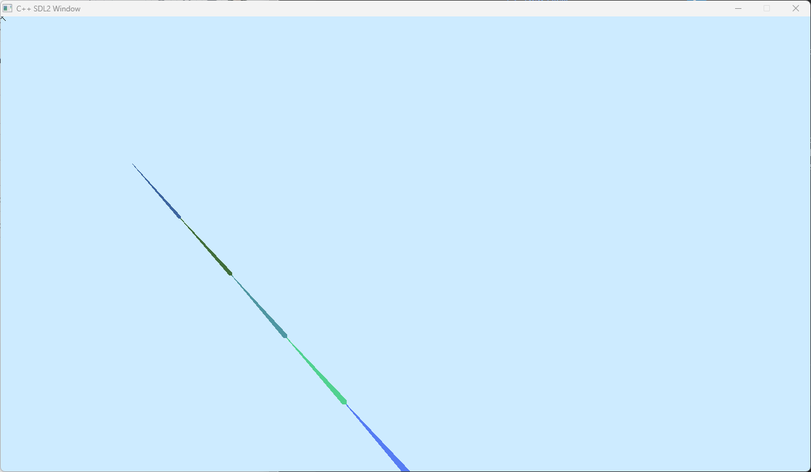
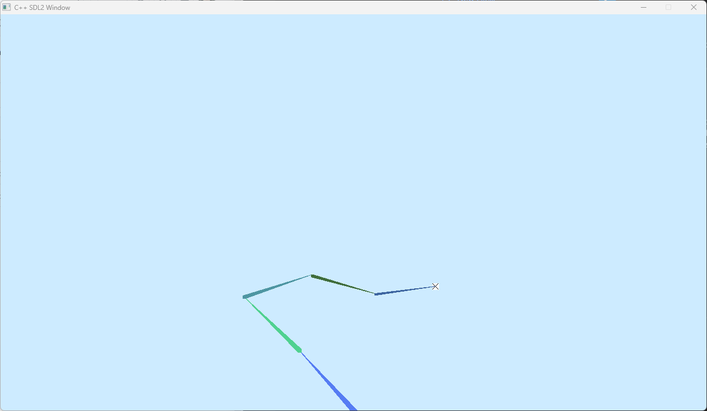
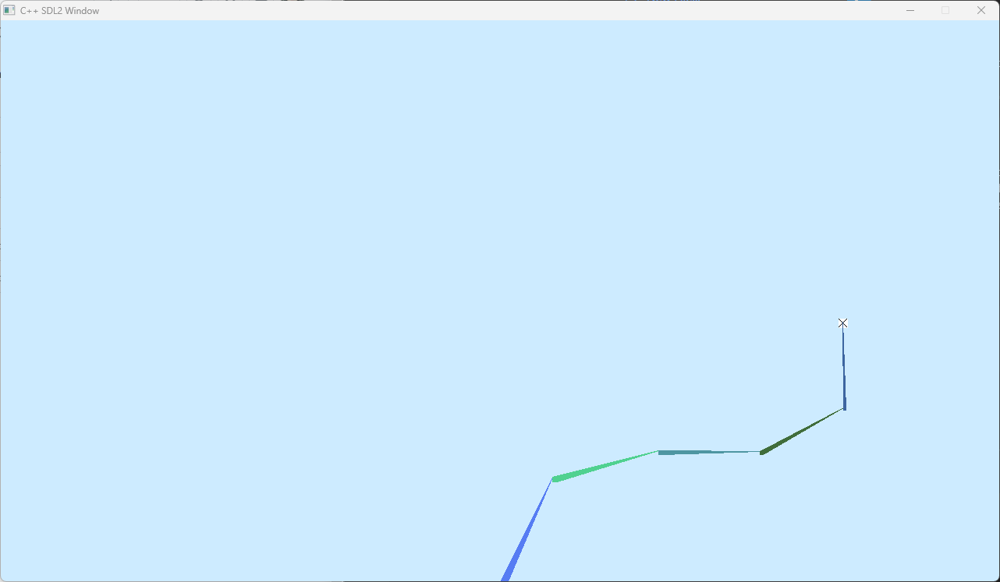

# Inverse Kinematics Simulation
Simulate the movement of a robotic arm with a 2D implementation of the FABRIK algorithm in C++ and visualization using SDL

## YouTube short project walkthrough: [Youtube](https://youtu.be/SBgf7nwn8SQ)

## Below are some screenshots of the app in action

#### Initialized app

#### Target 1 set

#### Target 2 set

